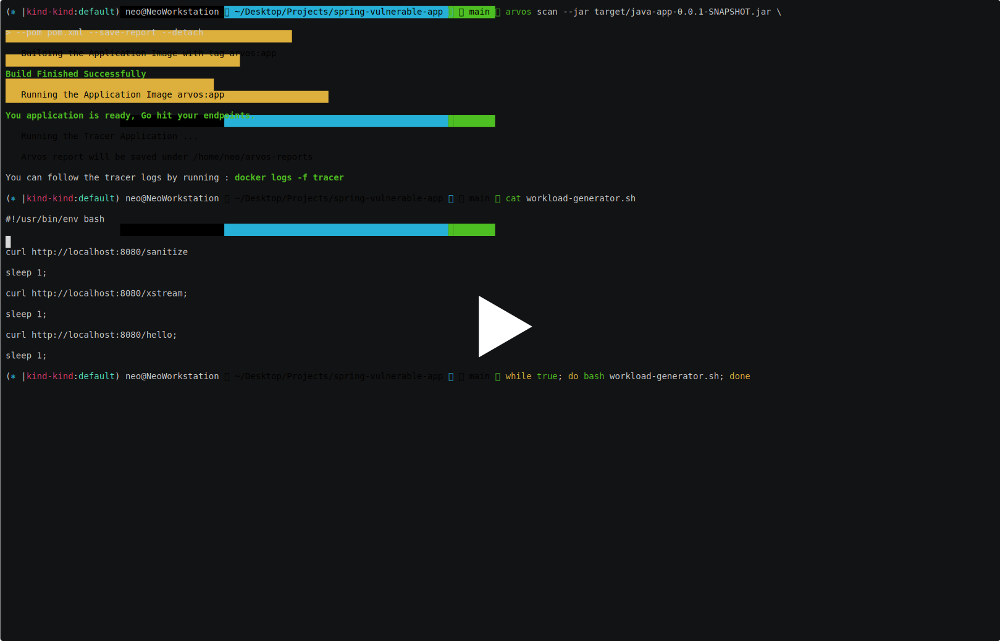

Arvos Utility Tool
=====================

AI and Risk-based Vulnerability Management for Trustworthy Open Source Adoption

Requirements
--------------------------

1. Python >= 3.9 and pip installed
2. Docker installed
3. Debugfs mounted ( sudo mount -t debugfs debugfs /sys/kernel/debug )
4. Linux kernel headers ( If not installed already )
    - Ubuntu/Debian : apt-get install -y linux-headers-$(uname -r)
    - CentOs : yum install -y kernel-devel
    - Fedora : dnf install -y kernel-devel

How to install
------------------

::

    $ pip install arvos
    $ arvos --help

Usage
------

Demo usage : 

::

    $ arvos --demo

The following command will build a Java application image ( based on jdk 17 ) from the specified jar, run it, and start the tracer app for a period of 2 minutes.

::

    $ arvos scan --java 17 --jar target/application.jar --trace-period 2 --save-report pdf --pom pom.xml

A .pdf report will be saved under your $HOME/arvos-reports folder. 

Output 
------

Supported platforms
---------------------

Linux only.

